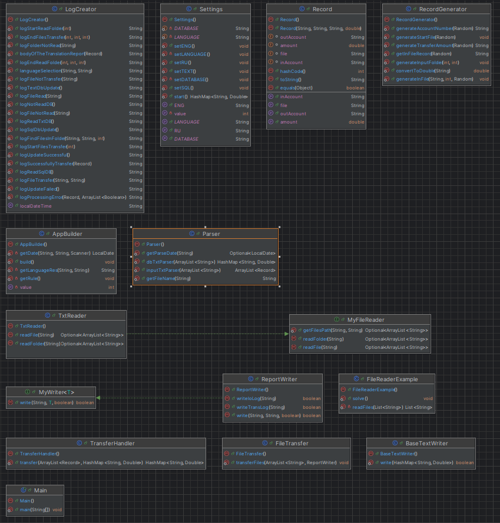
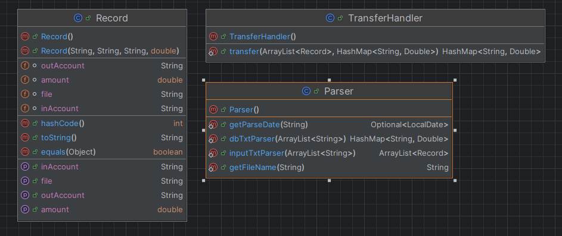
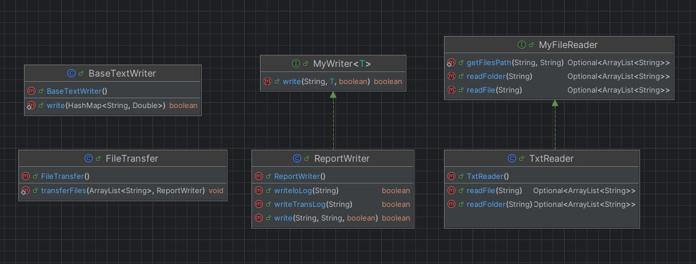
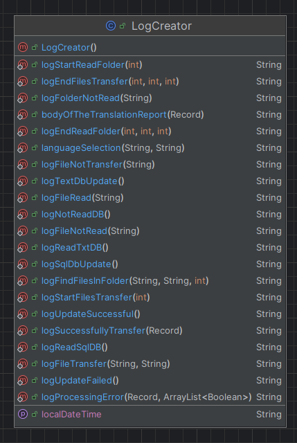
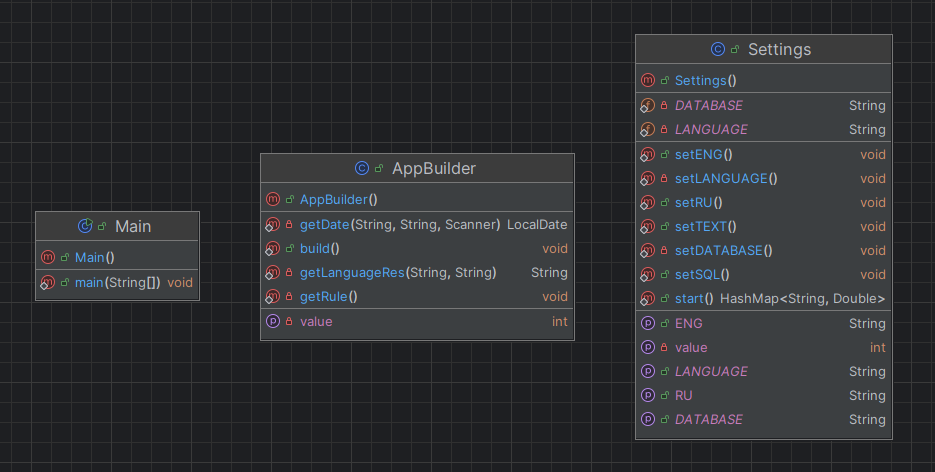

# Java Core Final Project
## Condition
### Task Description
Create a program to perform a money transfer from one account to another.
The program must have a file with account numbers and balances
on them. When the program is launched, it must wait for input from the console.
When selecting the parsing function, the program must parse all suitable files from
the 'input' directory and move the parsed files to another directory 'archive'. As a
result of parsing the files, the program must generate/update a report file and
update the information in the file with account numbers and balances to the current ones.
### Technical Implementation Details
When launched, the program expects input information:

    1 entered in the console - call the file parsing operation transfers from input,
    2 entered in the console - call the operation to display the list of all transfers from the report file.
    3 entered in the console - call the operation to display the list of all transfers from the report file in the entered time period.

The program must process txt files.

If there are files of a different format in the directory, the program must skip them and not
process them. Provide for various cases and implement checks.
For example, there are no suitable files in the directory, a negative transfer amount,
invalid account numbers and others. Provide for other possible
cases of occurrence and processing of errors and exceptions. Provide for the preservation
Java classes by "layers". A layer will be considered just a directory/package in the source
project code. For example, the model layer is the directory in which the classes for
data models (account class and others); the exception layer is the directory in which
classes for working with exceptions will be located; The names of the directories (layers) and their
number - at the discretion of the student.
### Input Data
Input file format: txt.

The files must contain the fields:

    ● account number from (10 digits XXXXX-XXXXX);
    ● account number to (10 digits XXXXX-XXXXX);
    ● transfer amount (integers only).
The input file may contain any number of other fields, but during
file processing, you need to get information only from the three described above.
The student is responsible for creating the input files.

### Output Report File
The output report file must contain a list of processed operations indicating
the file, the operation status, the date and time of the operation.

Example of the output report file:

    date-time | file_1 | transfer from XXXXX-XXXXX to YYYYY-YYYYY 500 | successfully processed
    date-time | file_1 | transfer from XXXXX-XXXXX to YYYYY-YYYYY -100 | error during processing, incorrect transfer amount
    
The output report file must be in txt format.

The output report file is generated after calling the operation
file-transfers processing. The output report file can be saved anywhere.

## Package and Class Description
### Packages:
- crs (courses) - contains all the programs
- developerclasses - contains auxiliary classes not related to the program's work
- jcfpapp (java core final project application) - classes related to the program's work
    - build - classes responsible for organizing the program's work
    - configuration - contains the class for setting up the program's settings and the initial database
    - services - classes directly implementing the logic
    - utils - auxiliary classes (file reading/writing, log creation)
        - log - log classes
        - reader.fileReader - file reading classes
        - writer.fileWriter - file writing classes
    - report - contains report files
    - resources - contains input and archive directories
### Classes
- (package) developerclasses:
    - RecordGenerator - creates input files with random data for the program
- (package) jcfpapp.build:
    - AppBuilder - responsible for organizing the program's work
    - Main - launches the program with the AppBuilder class
- (package) jcfpapp.configuration:
    - textDatabases.txt - text database with accounts and their balances
    - Settings - sets the language and database settings *(not implemented in this version)*
- (package) jcfpapp.services:
    - Parser - converts input file strings into necessary objects
    - Record - auxiliary object for processing transfers
    - TransferHandler - class responsible for transfers
- (package) jcfpapp.utils.log:
    - LogCreator - creates logs for the report
- (package) jcfpapp.utils.reader.fileReader:
    - MyFileReader - interface for file reading classes **(contains a method for extracting all files of the specified format from a folder)**
    - TxtReader - implements the MyFileReader interface
- (package) jcfpapp.utils.writer.fileWriter:
    - BaseTextWriter - writes the updated account balances to textDatabases.txt
    - ReportWriter - responsible for writing logs
- (package) jcfpapp.utils:
    - FileTransfer - moves processed files from the input directory to the archive
## Class Diagrams

